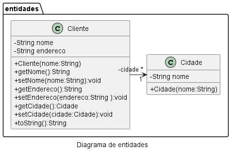

# FSO 2024/2 - Revisão Orientação a Objetos

## Configuração do Ambiente

- [Download do JDK Adoptium](https://adoptium.net/download/)
- [Download do JDK Microsoft OpenJDK](https://www.microsoft.com/openjdk)
- [Download do JDK AWS Corretto](https://aws.amazon.com/pt/corretto/?filtered-posts.sort-by=item.additionalFields.createdDate&filtered-posts.sort-order=desc)

- [Download VSCode ❤️](https://code.visualstudio.com/Download)

- [Extensão Java VSCode](https://marketplace.visualstudio.com/items?itemName=vscjava.vscode-java-pack)
- [Extensão Spring Boot VSCode](https://marketplace.visualstudio.com/items?itemName=vmware.vscode-boot-dev-pack)

## Linguagem JAVA

- JRE - Java Runtime Edition (JVM = java.exe)
- JDK - Java Development Kit (JVM + Compilar javac.exe)

### Desenvolvimento em JAVA
1. Codifica o programa na linguagem Java, e salva o código em um arquivo com a extensão .java
2. Compilação: Executar javac.exe que transforma o .java, bytecode (.class)
3. Execução: executo java.exe passando os arquivos .class ou (.jar / .war)

### Criação de um projeto java no VSCode
1. Criar um pasta dentro do Onedrive
2. Abrir o VScode e teclar F1, digitar java na barra de busca e selecionar Java: Create Java Project
3. Selecionar a ferramenta de build: No building tool
4. Selecionar a pasta do projeto
5. Digitar o nome do projeto <ENTER>

## Classes de Entidade
